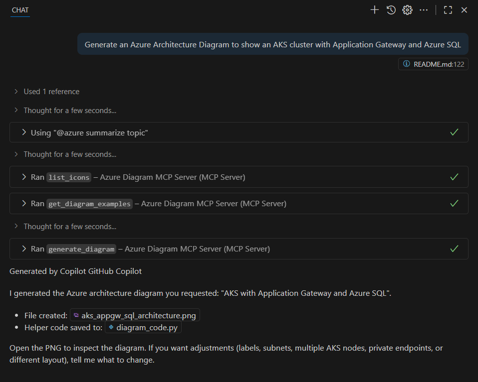
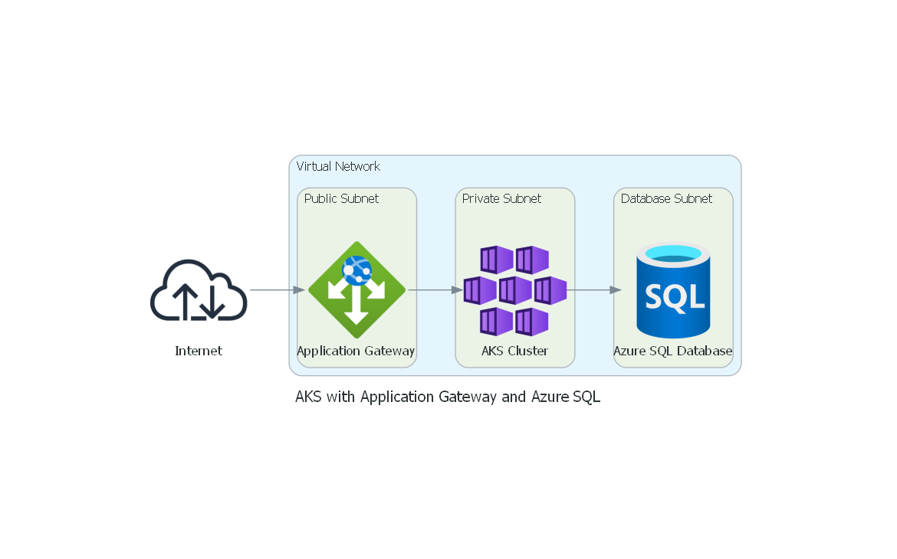

# Model Context Protocol (MCP) server for Microsoft  Azure Diagrams
[](#license)
[]()
[](https://diagrams.mingrammer.com/)






This tool lets you create Microsoft Azure architecture diagrams automatically.
You write a short description (using GitHub Copilot in Visual Studio Code to generate it), and the server will turn it into a diagram image.
It’s perfect for anyone who wants to quickly draw cloud diagrams without dragging shapes around.

## What's included
This MCP server seamlessly creates [diagrams](https://diagrams.mingrammer.com/) using the Python diagrams package DSL.
This server allows you to generate Microsoft Azure diagrams, sequence diagrams, flow diagrams, and class diagrams using Python code.

## What it does
- Turn a short plain-English sentence into a clean Azure architecture diagram (PNG).
- Uses the Python `diagrams` package and Azure icons behind the scenes.
- Saves images into the `diagrams/` folder in this project.


## Features

The Diagrams MCP Server provides the following capabilities:

1. **Generate Diagrams**: Create Azure diagrams using Python code
2. **Multiple Diagram Types**: Support for Azure architecture, sequence diagrams, flow charts, class diagrams, and more
3. **Customization**: Customize diagram appearance, layout, and styling


## What you’ll need

1. **Visual Studio Code** installed → [Download here](https://code.visualstudio.com/)
2. **GitHub Copilot** → [Enable here](https://github.com/features/copilot)
3. **Python** → we’ll install this in the steps below
4. **GraphViz** (a small program that actually draws the diagrams) → [Download here](https://graphviz.org/download/)
Don’t worry — we’ll go step by step!

---

## Setup Steps or use .devcontainer

### 1. Install Python

Open a terminal (Command Prompt, PowerShell, or VS Code Terminal) and run:

```bash
winget install Python.Python.3.10
```

### 2. Install GraphViz

Download and install from: [https://graphviz.org/download/](https://graphviz.org/download/)
On Windows: pick the MSI installer.
On Mac: use Homebrew (`brew install graphviz`).

### 3. Get the MCP Server

Clone this repository (or download the ZIP and unzip it).
Then open it in **VS Code**.

In the VS Code terminal, run:

```bash
pip install -r requirements.txt
```


## 4. MCP Configuration
Configure the MCP server in your MCP client configuration (e.g., for Visual Studio Code GitHub Copilot `~/.vscode/mcp.json`):

```json
{
  "mcpServers": {
    "Azure Diagram MCP Server": {
      "command": "python",
      "args": [
        "-m", "azure_diagram_mcp_server.server"
      ],
      "cwd": "PARENT_OF_CLONED_REPO",
      "autoApprove": [],
    }
  }
}
```

or docker after a successful `docker build -t azure-diagram-mcp-server .`:

```json
  {
    "mcpServers": {
      "Azure Diagram MCP Server": {
        "command": "docker",
        "args": [
          "run",
          "--rm",
          "--interactive",
          "--env",
          "azure-diagram-mcp-server:latest"
        ],
        "disabled": false,
        "autoApprove": []
      }
    }
  }
```

That’s it! 🎉 You now have everything installed.


## Using it with GitHub Copilot

1. Open up `VS Code GitHub Copilot Agent Mode`
1. Type the following into the chat:

   ```
   Generate an Azure Architecture Diagram with an Azure Function connected to a SQL Database through a Load Balancer
   ```
2. GitHub Copilot will want to execute the MCP Function `generate_diagram`. Please click on `Allow` to continue.
3. A **PNG image** will be created in the `diagrams` folder. Open it and admire your Azure diagram! 🚀


## Example prompt ideas
- `Generate an Azure Architecture Diagram with an Azure Function connected to a SQL Database through a Load Balancer`
- `Generate an Azure Architecture Diagram for a simple web app: Azure Front Door to App Service with Azure SQL` 
- `Generate an Azure Architecture Diagram to show an AKS cluster with Application Gateway and Azure SQL` 
---
  
## Example Diagram
`Generate an Azure Architecture Diagram to show an AKS cluster with Application Gateway and Azure SQL`


## Troubleshooting
* **No image appears?** Make sure GraphViz is installed (see step 2).
* **Copilot doesn’t run?** Make sure the GitHub Copilot extension is enabled and that you allowed it to run MCP functions. Check the MCP server too.
* **Still stuck?** Restart VS Code and try again.

---

✨ That’s it! You can now create **Azure diagrams in minutes** with just a few words and GitHub Copilot.
